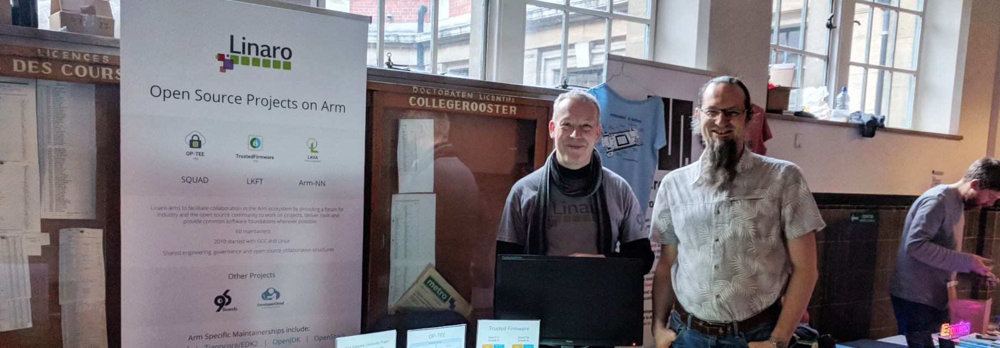

## About me

* Works at Linaro
* Development work on Linux, Zephyr and LAVA
* Occasional work on test automation, graphics and communication stacks
* Various demos and training material for Embedded World, IoT World Congress and Embedded Linux Conference
